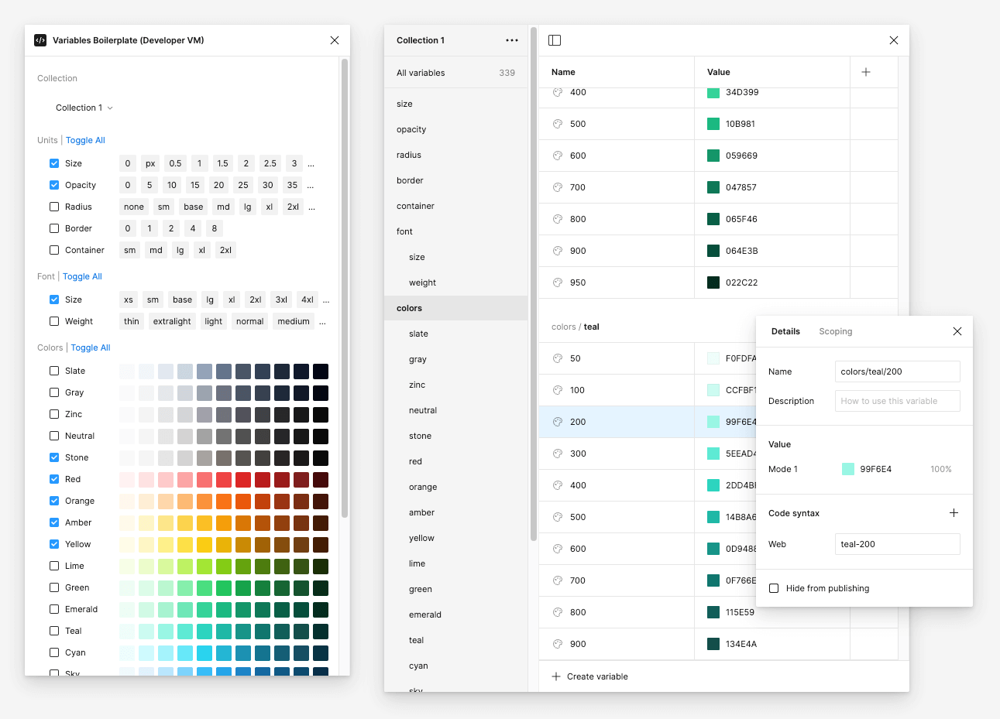

# Variable Boilerplate

> A Figma Plugin to quickly add Tailwind variables to your Figma document



## Usage guide

### Overview

The following tokens / variables are supported:

- Units
  - `size`
  - `opacity`
  - `radius`
  - `border`
  - `container`
- Font
  - `size`
  - `weight`
- Colors
  - `all`

Created variables have the following properties:

- `name`
- `value`
- `scope`
- `code syntax` (assigns Tailwind tokens to the `WEB` platform)

To review the source config, see:

- [Tailwind values](blob/main/src/config/tailwind.ts)
- [Figma variables](blob/main/src/config/figma.ts)

### Usage

You need to [build](#build-the-plugin) or [install](https://www.figma.com/community/plugin/1281668905420544225/variables-starter) the plugin before using.

Then:

- go Toolbar > Resources > Plugins > Variables Boilerplate
- click to toggle individual options
- click "Toggle all" to toggle an entire group
- click "Create" to create variables

To view the created variables:

- select nothing on canvas
- click "Local variables" in the sidebar

## Development guide

> This plugin is built with [Create Figma Plugin](https://yuanqing.github.io/create-figma-plugin/).

### Pre-requisites

- [Node.js](https://nodejs.org) – v20
- [Figma desktop app](https://figma.com/downloads/)

### Build the plugin

To build the plugin:

```
$ npm run build
```

This will generate a [`manifest.json`](https://figma.com/plugin-docs/manifest/) file and a `build/` directory containing the JavaScript bundle(s) for the plugin.

To watch for code changes and rebuild the plugin automatically:

```
$ npm run watch
```

### Install the plugin

1. In the Figma desktop app, open a Figma document.
2. Search for and run `Import plugin from manifest…` via the Quick Actions search bar.
3. Select the `manifest.json` file that was generated by the `build` script.

### Debugging

Use `console.log` statements to inspect values in your code.

To open the developer console, search for and run `Show/Hide Console` via the Quick Actions search bar.

## See also

- [Create Figma Plugin docs](https://yuanqing.github.io/create-figma-plugin/)
- [`yuanqing/figma-plugins`](https://github.com/yuanqing/figma-plugins#readme)

Official docs and code samples from Figma:

- [Plugin API docs](https://figma.com/plugin-docs/)
- [`figma/plugin-samples`](https://github.com/figma/plugin-samples#readme)
